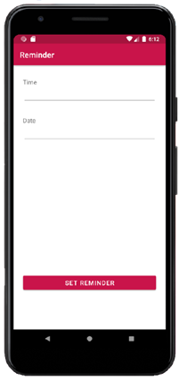
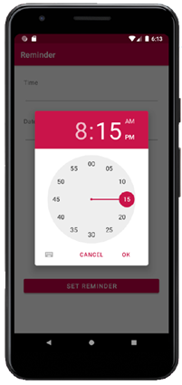
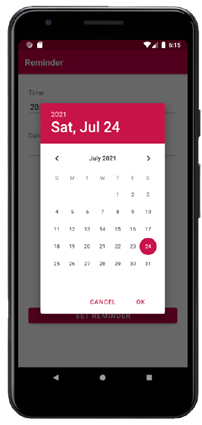

# Android App Library: Time and Date Picker

## About
Welcome to our Android application. The app is part of the Open Sorce [Android App Library](https://github.com/LukPle/android-app-library.git) 
and adopts all licensing and community guidelines from this project. Please use the link in order to check out the corresponding repository.

The time-and-date-picker app contains two input fields. One of them opens a **TimePickerDialog** and the other one a **DatePickerDialog**.
Clicking the Button shows a **Toast** message with the selected time and date. The application serves as an example of these features.

## Features
The setting of this program is a reminder app. The user can select a time and date via the two picker. A Toast message shows those values by setting the reminder.  

## Usage
You can clone the repository into Android Studio by clicking "Get from VCS" in the Welcome Screen or navigating to "File - New - Project from Version Control" inside 
the IDE. When doing so use the URL provided by GitHub. You can run the app on your mobile device or an emulator. Feel free to modify the code or utilize this sample 
for your own project.
